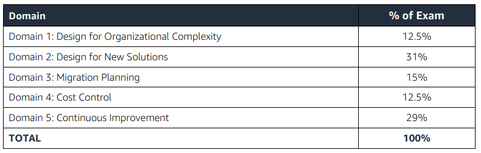

# aws-sa-profesional
## Scope Of the Exam (SAP-C01)

main 1: Design for Organizational Complexity
1.1 Determine cross-account authentication and access strategy for complex organizations.
 Analyze the organizational structure
 Evaluate the current authentication infrastructure
 Analyze the AWS resources at an account level
 Determine an auditing strategy for authentication and access
1.2 Determine how to design networks for complex organizations.
 Outline an IP addressing strategy for VPCs
 Determine DNS strategy
 Classify network traffic and security
 Determine connectivity needs for hybrid environments
 Determine a way to audit network traffic
1.3 Determine how to design a multi-account AWS environment for complex organizations.
 Determine how to use AWS Organizations
 Implement the most appropriate account structure for proper cost allocation, agility, and
security
 Recommend a central audit and event notification strategy
 Decide on an access strategy

Free courses from AWS.

* EC2 Systems Manager: https://www.aws.training/learningobject/curriculum?id=13830
* Introduction to AWS Config https://www.aws.training/learningobject/video?id=16020
* Exam Readiness: AWS Certified DevOps Engineer – Professional https://www.aws.training/learningobject/wbc?id=19689
* https://docs.aws.amazon.com/vpc/latest/peering/peering-configurations-partial-access.html

